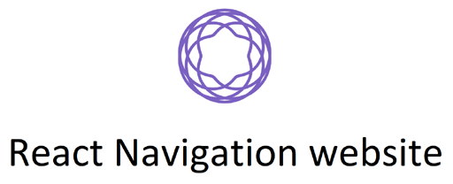

<h2 align="center"><a href="https://reactnavigation.org/">  </a></h2>


Want to help improve the documentation? That would be so very much appreciated. Some information on that below.

## Philosophy of documentation

- _Document the ugly parts as much as the good parts._ It's better for users to know that we don't have a good solution to the problem they have and get the preferred workarounds from us than have to scour the dark and moist corners of StackOverflow.
- _Provide runnable examples where possible._ Learning through interacting with the code is a reason why REPLs are so popular. Thanks to [Snack](https://snack.expo.io) we can provide the same kind of experience for React Navigation users too.
- _Be honest about the tradeoffs and limitations._ We explain the pitch and anti-pitch of React Navigation and provide alternative libraries if React Navigation might not be a good fit. We should provide a similar level of honesty at finer levels of granularity as well.

## Things anyone can do

### Run it locally

1. Clone the repository
2. Run `yarn`
3. `yarn start`

### Make changes

- Each documentation version of `react-navigation` is generated by the markdown files located in `versioned_docs`. Change them and refresh the page when running the documentation locally and you will see the changes reflected.
- If you want to add a new page, you need to add it to the corresponding [sidebars.json file](https://github.com/react-navigation/react-navigation.github.io/tree/main/versioned_sidebars) and then restart the server.

## Things you need to be a collaborator to do

_Deployment is done automatically via Github Actions. Normally you shouldn't need to do these._

### Download the latest translations

- Configure `CROWDIN_DOCUSAURUS_PROJECT_ID` and `CROWDIN_DOCUSAURUS_API_KEY` environment variables (ask [@brentvatne](https://github.com/brentvatne) if you need access).
- Run `yarn crowdin-upload` and then `yarn crowdin-download`

### Update the sponsors list

- Create a Github "Personal Access Token" [here](https://github.com/settings/tokens) and set the `read:org` scope on it.
- Set the environment variable `REACT_NAV_GITHUB_TOKEN` to that value.
- Run `yarn fetch-sponsors`.
- Commit the updated `sponsors.js` file.

### Deploy it

_Before deploying, be sure to download the latest translations!_

Only collaborators on this repository can deploy. Run the following command from the `main` branch:

```bash
GIT_USER=<Your GitHub username> \
CURRENT_BRANCH=main \
USE_SSH=true \
yarn deploy
```

## License
[MIT License](LICENSE)