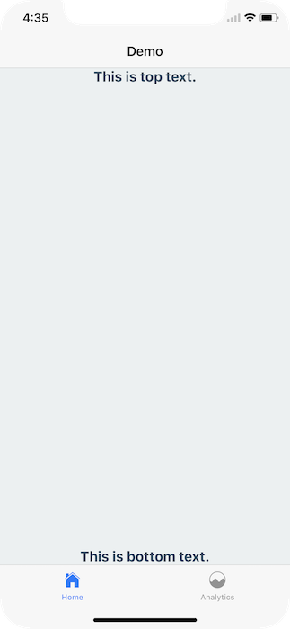
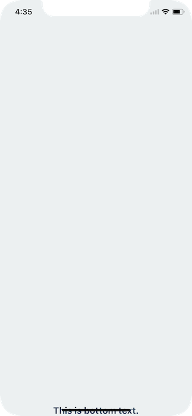
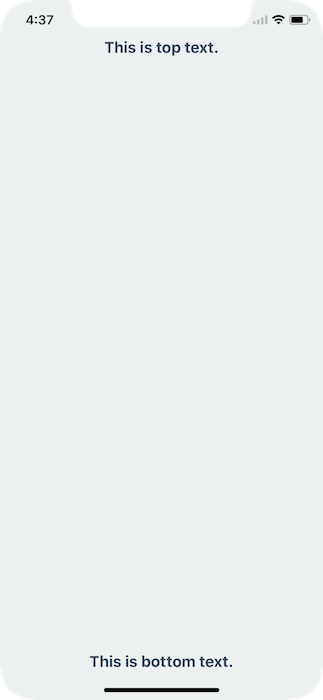
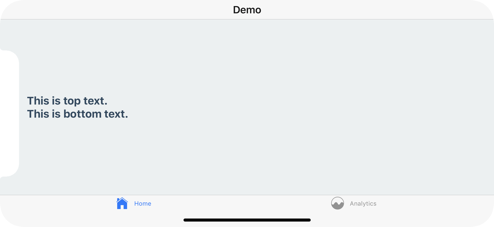

By default React Navigation aids in ensuring your application displays correctly on the iPhoneX. It does so by using `SafeAreaView` inside of UI elements that may interact with the sensor cluster ("the notch") or the home activity indicator.

## Hidden/Custom Navigation Bar or Tab Bar



However, if you're overriding the default navigation bar it's important to ensure your UI doesn't interfere with either of those hardware elements.

For example, if I render nothing for the `header` or `tabBarComponent` nothing renders

```javascript
const Tabs = TabNavigator({
  ...
}, {
  tabBarComponent: () => null,
});

export default StackNavigator({
  ...
}, {
  headerMode: 'none',
});
```



To fix this issue you can wrap your content in a `SafeAreaView`, which can be imported from either `react-native` or `react-navigation`.

```javascript
import { SafeAreaView } from 'react-navigation';

class App extends Component {
  render() {
    return (
      <SafeAreaView style={styles.container}>
        <Text style={styles.paragraph}>This is top text.</Text>
        <Text style={styles.paragraph}>This is bottom text.</Text>
      </SafeAreaView>
    );
  }
}
```



This will detect if the app is running on an iPhoneX and, if so, ensure the content isn't hidden behind any hardware elements.

## Landscape Mode

Even if you're using the default navigation bar and tab bar if your application works in landscape mode it's important to ensure you content isn't hidden behind the sensor cluster.


To fix this you can, once again, wrap your content in a `SafeAreaView`. This will not conflict with the navigation bar or tab bar's default behavior in portrait mode.



In conclusion, use the `SafeAreaView` component on the screens you register with a React Navigation navigator.

A [Snack](https://snack.expo.io/BJ6-M8pEG) is available with the code used in this overview.
